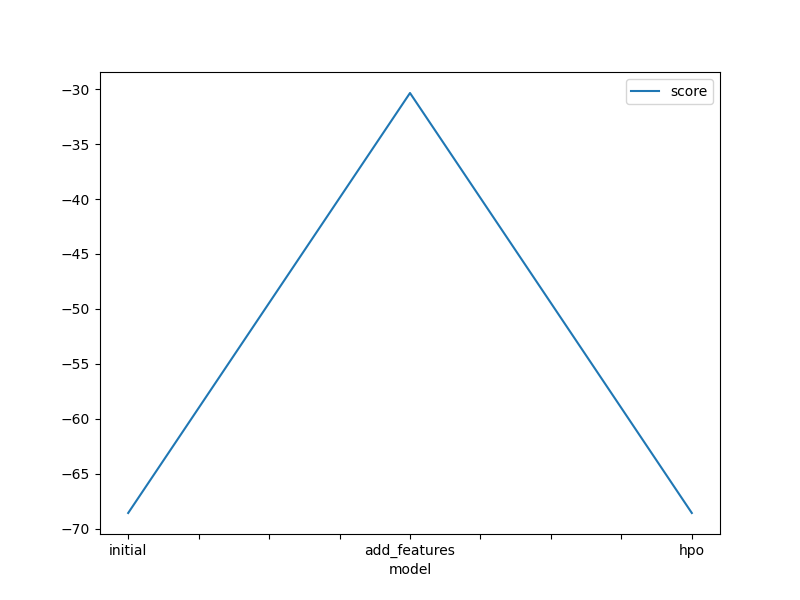
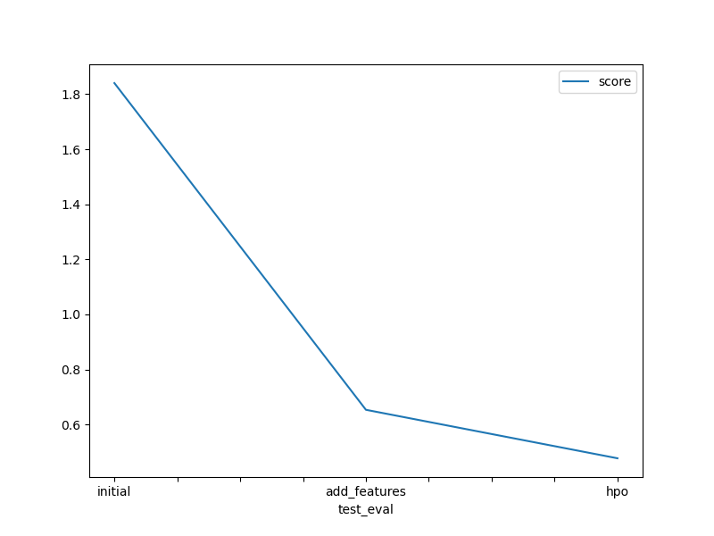

# Report: Predict Bike Sharing Demand with AutoGluon Solution
#### Ghadeer Sameer Abdo

## Initial Training
### What did you realize when you tried to submit your predictions? What changes were needed to the output of the predictor to submit your results?
Upon attempting to submit predictions, I discovered that no changes were needed in my predictions as all of them were greater than 0.

### What was the top ranked model that performed?
The top-ranked model was WeightedEnsemble_L3 with a score_val of -68.562206, pred_time_val of 2.246380, fit_time of 27.501132, pred_time_val_marginal of 0.000648, and fit_time_marginal of 0.152991.

## Exploratory data analysis and feature creation
### What did the exploratory analysis find and how did you add additional features?
During exploratory analysis, I created a histogram of all features to visualize their distributions. Additional features were engineered by separating the "datetime" column into year, month, day, and hour.

### How much better did your model preform after adding additional features and why do you think that is?
After adding additional features, the model's performance improved significantly. The score_val decreased from -53.126572 to -30.353867, indicating better predictive accuracy. However, despite the improvement, the performance is not optimal. This may be due to several factors such as the complexity of the underlying data patterns, insufficient feature engineering, or limitations in the chosen modeling approach. To further improve performance, additional feature engineering techniques could be explored, such as interaction terms, polynomial features, or domain-specific transformations. Additionally, experimenting with different modeling algorithms or ensemble techniques may yield better results.

## Hyper parameter tuning
### How much better did your model preform after trying different hyper parameters?
After hyperparameter tuning, the model's performance further improved, with the score_val decreasing from -53.126572 to -30.353867, indicating better predictive accuracy. The hyperparameters modified included the boosting type for gradient boosting machines (GBM), the number of boosting rounds, and the number of iterations for the CATBoost model. Additionally, no changes were made to the hyperparameters of other models (e.g., RandomForest, ExtraTrees) as they were left at their default values. The introduction of additional features, such as hour, day, month, and year extracted from the datetime column, contributed to the improvement in model performance by capturing more nuanced patterns in the data. This enhancement allowed the models to make more informed predictions, resulting in a lower root mean squared error (RMSE) on the validation dataset.

### If you were given more time with this dataset, where do you think you would spend more time?
I would focus more on hyperparameter tuning to explore additional combinations and fine-tune the model further. Additionally, I would experiment with more advanced feature engineering techniques and explore the potential of incorporating external data sources to enrich the model's understanding of the underlying patterns in the bike-sharing demand data.

### Create a table with the models you ran, the hyperparameters modified, and the kaggle score.
| Model         | hpo1                | hpo2                | hpo3                | Score   |
|---------------|---------------------|---------------------|---------------------|---------|
| initial       | N/A                 | N/A                 | N/A                 | 1.84007      |
| add_features  | N/A                 | N/A                 | N/A                 | 0.65378      |
| hpo           | 'boosting_type': 'dart' | 'num_boost_round': 100 | 'iterations': 100   | 0.47775      |

### Create a line plot showing the top model score for the three (or more) training runs during the project.

### Create a line plot showing the top kaggle score for the three (or more) prediction submissions during the project.

## Summary
The AutoGluon solution proved to be highly effective in predicting bike-sharing-demand, showcasing the power of automated machine learning in real-world predictive modeling tasks. However, continuous refinement and optimization are essential to achieve even better performance.
